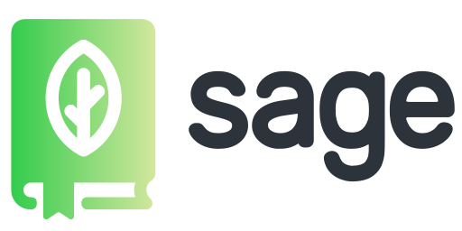

  

  a marvelous data exchange protocol for APIs

 

# sage

## intro

sage allows you to easily build & consume fully typesafe APIs, without schemas or code generation.

### features

- ✅&nbsp; well-tested and production ready.
- 🧙‍♂️&nbsp; full static type safety & autocompletion on the client, for inputs, outputs and errors.
- 🐎&nbsp; fantastic DX - No code generation, run-time bloat, or build pipeline.
- 🍃&nbsp; light -- Sage has zero dependencies and a tiny client-side footprint.
- 🐻&nbsp; easy to add to your existing brownfield project.
- 🔋&nbsp; batteries included.
- 🥃&nbsp; subscriptions support.
- ⚡️&nbsp; request batching - requests made at the same time can be automatically combined into one
- 👀&nbsp; we have a few examples in the [./examples](./examples) folder :)

### overview

this is the working draft for **sage**, a data exchange protocol for APIs, and reference implementations of a runtime and capable of executing queries with your existing data and business logic. the [specification](https://libre.dorkodu.com/sage/paper) is open source; created and governed @ [dorkodu](https://dorkodu.com).

### about the protocol*

the target audience for the protocol specification are not the product developers; but those who have, or are actively interested in, building their own sage implementations and tools.

in order to be broadly adopted, we want sage to support wide variety of platforms, which will necessitate a collaborative effort across projects and communities. 

this specification serves as a compass for implementation and development efforts of sage.

looking for more? [see sage’s website](https://libre.dorkodu.com/sage/).

## quickstart

⏳ — work in progress.

## protocol

the sage specification paper (we call it shortly _the paper_) is edited in the markdown files found in [**/paper**](./paper) folder.
the latest working draft and releases of the paper can be found at this repository.

## documentation

- **[website](https://libre.dorkodu.com/sage/)**

- **[reference documentation & learning material](https://libre.dorkodu.com/sage/learn/)**

- **[libraries, tools and community work](https://libre.dorkodu.com/sage/code/)**

- **[faq](https://libre.dorkodu.com/sage/faq/)**

## people

<table>
  <tr>
    <td align="center">
      <a href="https://doruk.dorkodu.com">
        
         
      </a>
    </td>
    <td>
			<b>doruk eray</b>
       
      creator of sage
			 
      founder and chief @ <b><a href="https://dorkodu.com">dorkodu</a></b>
			 
      
      
      · <a href="https://doruk.dorkodu.com">website</a>
    </td>
  </tr>
</table>

## sponsors

if you enjoy working with sage and want to support me consider giving a token appreciation by [github sponsors](https://github.com/sponsors/dorukeray)!
also, if your team uses sage and you want to support long-term maintenance of sage, [get in touch](mailto:doruk@dorkodu.com) to discuss potential partnerships.

## license
sage is open-sourced software licensed under the [**mit license**](LICENSE).